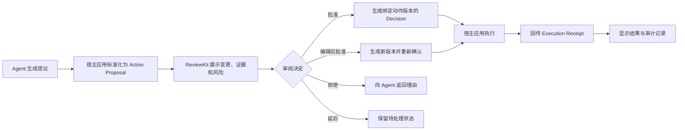

# Agent Change Review SDK 产品需求文档

> 工作名称：ReviewKit / Agent Change Review SDK  
> 版本：v0.1  
> 状态：验证版 PRD  
> 日期：2026-09-02  
> 产品负责人：待确认

## 1. 产品摘要

Agent Change Review SDK 是一个可嵌入现有 AI Agent 产品的变更审阅组件。它把 Agent 即将执行的业务操作转换成用户能够理解、检查和修改的审阅界面，使用户可以在执行前逐项或批量批准、编辑、拒绝，并在执行后查看结果与证据。

首个版本聚焦结构化业务变更，包括 JSON 对象、表格记录和文本内容，不负责创建 Agent、调用模型或直接执行外部系统操作。

一句话定位：**面向业务数据和 Agent 行为的 Pull Request。**

## 2. 背景与机会

越来越多的 Agent 不再只回答问题，而是修改 CRM、发送邮件、调整配置、更新表格或触发订单等真实业务动作。现有 Agent 框架通常能暂停执行并返回“需要批准”的信号，但客户仍需自行完成变更展示、字段级编辑、批量审阅、状态恢复、审计和执行结果关联。

基础的“批准/拒绝”按钮正在成为框架标配，难以单独形成商业壁垒。真正困难且可重复销售的部分，是让审阅者准确理解 Agent 将改变什么，并确保批准内容与最终执行内容一致。

本产品选择稳定的“提议变更”作为核心对象，不绑定特定模型、Agent 框架或执行平台。模型和框架可以变化，但业务系统在重要修改前需要审阅、留痕和追责的需求相对稳定。

## 3. 产品目标与非目标

### 3.1 产品目标

1. 让开发者在一天内为 Agent 产品接入生产可用的变更审阅体验。
2. 让审阅者在一个界面中看清修改前后、影响范围、理由、证据与风险。
3. 让批准决定绑定到确定的动作版本，避免“批准内容”和“实际执行内容”不一致。
4. 通过开源核心获得开发者采用，通过团队治理、审计和商业支持实现付费转化。
5. 在 90 天内验证是否存在真实生产接入与付费意愿，而不是仅验证下载量或口头兴趣。

### 3.2 非目标

首版不提供以下能力：

- 通用 Agent 创建、Prompt 编排或模型路由；
- 聊天 UI、记忆、RAG 或通用观测平台；
- 外部工具、数据库或 SaaS 的实际执行；
- 完整权限网关、凭证托管或企业策略引擎；
- 多租户 SaaS 管理后台；
- 十种以上 Agent 框架适配器；
- 面向所有业务领域的成品审批系统。

## 4. 目标用户与购买角色

| 角色 | 典型身份 | 核心需求 | 成功标准 |
|---|---|---|---|
| 集成开发者 | Agent 工程师、全栈工程师 | 快速接入，不改造现有执行架构 | 一天内接入，接口稳定，文档清楚 |
| 最终审阅者 | 运营、销售、客服、财务或业务负责人 | 看懂变化，快速判断，避免误操作 | 能批量处理且不会盲目批准 |
| 产品负责人 | AI 产品经理、创业公司创始人 | 提升 Agent 可控性和用户信任 | 更敢开放高价值写操作 |
| 技术买方 | CTO、研发负责人、AI 平台负责人 | 降低自研和长期维护成本 | 组件可靠、可扩展、可审计 |
| 企业治理角色 | 安全、法务、合规、IT | 权限、证据、责任和数据边界 | 决策与执行链路可追溯 |

### 4.1 首批理想客户

- 已经交付带写操作 Agent 的 B2B SaaS 团队；
- 为客户实施 Agent 自动化的集成商；
- CRM、客服、电商、营销和企业协同软件厂商；
- 企业内部正在建设 AI 平台、但尚未形成统一审阅能力的团队。

不优先面向普通中小企业老板直接销售。首阶段采用 B2D2B 路径：开发者发现和集成，企业团队购买商业能力。

## 5. 核心使用场景

### 5.1 批量修改业务记录

Agent 准备更新 300 条客户记录。审阅者可以按风险、字段、来源和修改幅度筛选，查看修改前后，逐字段编辑或批量批准安全项。

### 5.2 审阅即将发送的内容

Agent 生成一批客户邮件、工单回复或通知。审阅者可以比较原文与新内容，修改收件人和正文，拒绝不合适的条目，并查看内容依据。

### 5.3 审阅配置或结构化参数

Agent 准备修改系统配置、工作流参数或 API 请求。组件展示结构化 Diff、影响范围和风险提示，批准结果绑定到具体参数版本。

### 5.4 失败后的人工接管

外部执行失败后，宿主应用将结果回传。审阅者可以看到失败原因、成功与失败条目，选择修改后重新提交或交由人工处理。

## 6. 核心概念

### 6.1 Action Proposal

Action Proposal 是 Agent 提交给审阅组件的标准变更对象，至少包括：

- 唯一 ID 和版本；
- 动作类型与业务对象；
- 修改前状态与提议后状态；
- 人类可读摘要；
- Agent 给出的理由；
- 证据或数据来源；
- 风险等级与风险标签；
- 创建时间、过期时间和发起身份；
- 目标系统、目标资源及源数据版本；
- 可贯穿 Agent run、审阅和执行的 trace ID；
- 幂等键和动作内容哈希。

### 6.2 Review Decision

Review Decision 是审阅者对某一确定版本 Action Proposal 的决定，包括批准、编辑后批准、拒绝、延后或取消。任何影响执行参数的修改都会生成新版本并使旧批准失效。

### 6.3 Execution Receipt

Execution Receipt 由宿主应用在执行后回传，包括实际执行参数哈希、开始与结束时间、成功或失败状态、外部系统引用、错误信息和可选回滚结果。

## 7. 核心流程



产品不直接执行动作。宿主应用始终掌握执行权、凭证和外部系统连接。

## 8. 状态模型

状态分为 Proposal、Item 和 Execution 三层，避免把“已批准”误解为“已执行成功”。

### 8.1 Proposal 状态

| 状态 | 含义 | 允许操作 |
|---|---|---|
| `draft` | 提议尚未提交审阅 | 更新、提交、取消 |
| `pending_review` | 等待审阅 | 开始审阅、拒绝、取消、过期 |
| `reviewing` | 审阅者正在处理 | 编辑、批准、拒绝、延后 |
| `changes_requested` | 审阅者要求 Agent 重新生成 | 创建新 revision、取消 |
| `approved` | 某一确定 revision 已批准 | 请求执行、取消；内容变化时自动失效 |
| `rejected` | 已拒绝 | 查看理由、基于原提议创建新 revision |
| `expired` | 超过有效期 | 只读、重新提交新 revision |
| `cancelled` | 发起方取消 | 只读 |
| `superseded` | 已被更新版本取代 | 只读并跳转最新版本 |
| `invalidated` | 源数据在审阅期间已变化 | 重新拉取源数据、重新 Diff 和审阅 |

### 8.2 Item 状态

批量 Proposal 中的每个条目独立处于 `pending`、`approved`、`edited`、`rejected` 或 `invalidated` 状态。Proposal 只有在条目处理结果满足宿主规则时才能整体批准。

### 8.3 Execution 状态

Execution 独立处于 `not_started`、`queued`、`running`、`partially_succeeded`、`succeeded`、`failed` 或 `rolled_back` 状态。批准不代表执行成功，界面、API 和审计记录必须始终分开表达二者。

所有状态转换必须具备幂等性。同一 Decision 不得触发两次执行；Action Proposal 的 revision、目标系统、关键参数和内容哈希必须与 Decision 完全匹配。多人同时审阅时采用乐观锁，后提交者必须看到冲突并重新确认。

## 9. MVP 功能范围

### 9.1 P0：必须具备

#### Headless Core

- Action Proposal、Review Decision 和 Execution Receipt 的 TypeScript 类型与 JSON Schema；
- 确定性序列化、版本和 SHA-256 内容哈希；
- 审阅状态机和非法状态转换校验；
- 幂等键与回调事件；
- 浏览器本地状态存储接口，可替换为宿主实现。

#### React 组件

- 单条审阅详情；
- 列表与批量选择；
- 修改前后对比；
- 批准、编辑后批准、拒绝和延后；
- 结果、错误和执行证据展示；
- 主题变量、暗色模式和基础国际化；
- 键盘操作和基础无障碍语义。

#### 三种基础渲染器

- JSON：字段级新增、删除和修改；
- Text：行级或词级 Diff；
- Table：记录和单元格级变更、批量选择与筛选。

#### 开发者体验

- npm 安装包；
- 五分钟 Quick Start 和十分钟可运行示例；
- 在线 Playground，可粘贴 before/after 数据立即预览；
- 至少两个适配示例：OpenAI Agents SDK，以及 LangGraph 或 MCP Apps；
- 完整 TypeScript 类型、错误说明和迁移策略。

### 9.2 P1：付费试点候选

- 共享审阅队列和任务分配；
- 搜索、风险筛选、批量批准和部分批准；
- 审计记录导出；
- 领域渲染器扩展机制；
- 品牌和样式深度定制；
- Webhook 签名与重放保护；
- 执行失败后的部分重试体验。

### 9.3 P2：验证后再建设

- RBAC、SSO 和组织管理；
- 多级审批、双人复核、委派与超时升级；
- 私有部署和数据地域选择；
- 不可篡改审计与长期证据留存；
- Vue 组件和更多 Agent 框架适配器；
- 企业策略引擎与凭证代理；
- Slack、飞书、Teams 等外部审批入口。

## 10. 详细交互要求

### 10.1 审阅列表

审阅列表必须优先帮助用户识别风险，而不是简单按时间展示。默认显示动作摘要、业务对象、变更数量、风险等级、发起时间、过期时间和当前状态。

用户可以按状态、风险、动作类型和业务对象筛选，并对满足相同条件的低风险条目批量操作。高风险动作默认不进入一键批量批准。

### 10.2 审阅详情

详情页首先展示“将发生什么”和“影响多少对象”，其次展示具体 Diff、Agent 理由和证据。不得只展示 Agent 的自然语言摘要而隐藏实际参数。

审阅者必须能够展开原始结构化参数。对于批量变更，应提供仅看变化字段、仅看高风险项和仅看异常项等视图。

### 10.3 编辑后批准

审阅者修改任何执行字段后，组件必须创建新的 Action Proposal 版本并重新计算哈希。界面要明确提示“你批准的是修改后的版本”。

### 10.4 拒绝

拒绝理由支持预设标签和自由文本。宿主应用可以决定是否把理由返回给 Agent，用于重新规划或终止任务。

### 10.5 执行结果

组件展示宿主回传的真实执行结果，不以 Agent 自述代替。批量动作必须区分全部成功、部分成功和全部失败，并显示外部系统的引用或证据。

## 11. SDK 接口草案

### 11.1 Action Proposal 示例

```json
{
  "id": "act_01JXYZ",
  "version": 3,
  "type": "crm.contact.update",
  "subject": {
    "type": "contact",
    "count": 2
  },
  "summary": "更新 2 位客户的跟进等级",
  "before": [
    { "id": "c_1", "priority": "normal" },
    { "id": "c_2", "priority": "normal" }
  ],
  "after": [
    { "id": "c_1", "priority": "high" },
    { "id": "c_2", "priority": "high" }
  ],
  "reason": "客户在过去 7 天内连续访问报价页面",
  "evidence": [
    { "label": "访问事件", "ref": "event_batch_8291" }
  ],
  "risk": {
    "level": "medium",
    "tags": ["bulk_write"]
  },
  "expiresAt": "2026-09-03T10:00:00+08:00",
  "idempotencyKey": "crm-followup-20260902-001",
  "contentHash": "sha256:..."
}
```

### 11.2 React 接入示例

```tsx
<ActionReview
  proposal={proposal}
  renderers={[jsonRenderer(), textRenderer(), tableRenderer()]}
  onDecision={async (decision) => saveDecision(decision)}
  onRequestExecution={async (approvedDecision) => {
    return executeInHostApplication(approvedDecision);
  }}
/>
```

### 11.3 关键事件

| 事件 | 触发时机 | 关键字段 |
|---|---|---|
| `proposal.submitted` | 提议进入待审阅 | proposal ID、版本、哈希 |
| `review.started` | 用户进入审阅状态 | reviewer、时间 |
| `proposal.revised` | 审阅者修改执行字段 | 旧版本、新版本、新哈希 |
| `decision.approved` | 用户确认批准 | decision ID、proposal 版本、哈希 |
| `decision.rejected` | 用户拒绝 | 理由、标签 |
| `execution.started` | 宿主开始执行 | 幂等键、实际参数哈希 |
| `execution.completed` | 宿主回传结果 | 成功、部分失败、失败、证据 |

## 12. 安全、隐私与责任边界

1. 开源核心默认在宿主应用内运行，不将业务数据发送到 ReviewKit 云服务。
2. 组件不持有客户外部系统凭证，也不直接执行工具调用。
3. 批准决定必须绑定 proposal ID、版本和内容哈希；实际执行哈希不一致时默认拒绝执行。
4. 日志默认不记录完整敏感字段，宿主可以配置脱敏策略。
5. 所有回调支持幂等键；网络重试不得造成重复执行。
6. 高风险动作不得仅凭 Agent 的自然语言总结完成批准，必须允许查看实际参数。
7. 身份认证和权限判断由宿主应用负责；ReviewKit 接收经过认证的 reviewer identity。
8. 商业云服务上线前必须完成租户隔离、加密、审计和数据删除机制设计。
9. Agent 提供的文本、Markdown、链接和字段内容一律作为不可信数据渲染；组件不得执行任意 HTML、脚本或事件处理器。
10. Proposal 必须携带宿主源数据版本；执行前发现源对象已变化时，默认进入 `invalidated`，不得沿用旧批准。

## 13. 非功能需求

| 维度 | MVP 要求 |
|---|---|
| 接入效率 | 示例项目从安装到显示第一条 Proposal 不超过 10 分钟 |
| 性能 | 单个 Proposal 上限暂定 500 个 item、5 MB 结构化数据；首次可交互时间目标小于 1 秒；大列表使用虚拟化 |
| 可靠性 | 状态转换和回调幂等；页面刷新、短暂断网和 Webhook 重试后能恢复当前状态 |
| 兼容性 | 支持当前主流 React 稳定版本和现代浏览器 |
| 可扩展性 | 自定义 renderer 不需要 fork 核心包 |
| 可访问性 | 核心操作可用键盘完成，状态和按钮具备语义标签 |
| 可观测性 | proposal ID 和客户 trace ID 贯穿 Agent run、审阅与执行；不强绑定特定监控平台 |
| 包体积 | Headless Core 与 UI 分包，可按 renderer tree-shaking |
| 版本策略 | 遵循语义化版本；公开 schema 有明确兼容和迁移说明 |

性能目标在真实样本测试后调整，不以牺牲正确性和审阅信息完整性为代价。

## 14. 商业模式假设

### 14.1 Community

建议采用 MIT 或 Apache 2.0 开源：

- Headless Core；
- React 基础组件；
- JSON、Text 和基础 Table renderer；
- 本地使用和基础框架适配示例；
- 社区支持。

### 14.2 Pro

商业授权候选：

- 高级批量审阅与领域 renderer；
- 审计导出；
- 白标与主题系统；
- 团队共享队列；
- 优先支持和稳定版本维护。

可在验证页测试每开发者每年 499 美元和 999 美元两个价格锚点，但首批设计伙伴以付费试点合同为主，价格测试不等于最终定价。

### 14.3 Enterprise / OEM

- OEM 和再分发授权；
- 私有部署；
- RBAC、SSO 和多级审批；
- SLA、安全评估和长期支持；
- 定制领域 renderer，但不得维护客户专属产品分支。

## 15. 获客与分发

### 15.1 开发者自助渠道

- GitHub 开源仓库和 npm 包；
- 可直接操作的在线 Playground；
- 三个完整示例：CRM 批量修改、批量邮件、配置变更；
- “十分钟接入 Agent 审阅”技术文章和演示视频；
- OpenAI Agents、LangGraph、MCP Apps 等生态示例与模板。

### 15.2 主动寻找设计伙伴

不要询问抽象的“是否需要审批组件”，而是要求团队展示其现有流程：Agent 在什么情况下暂停、用户在哪里检查、批准内容如何绑定执行、失败后如何处理。

首轮外联对象：

- 已发布可执行 Agent 功能的创业团队创始人和技术负责人；
- B2B SaaS 的 AI 产品负责人；
- Agent 项目集成商；
- 开源 Agent 应用维护者。

### 15.3 内容策略

内容不围绕“AI 很危险”的泛泛叙事，而是展示可复现的工程问题：批准摘要与实际参数不一致、批量变更难以检查、页面刷新后状态丢失、重复回调造成二次执行、执行后缺乏证据。

## 16. 产品指标

### 16.1 北极星指标

**每周在真实宿主应用中完成、且能够关联执行结果的有效审阅数。**

该指标必须排除 Playground、示例项目和内部测试数据。

### 16.2 产品漏斗

| 阶段 | 指标定义 |
|---|---|
| 发现 | 文档访问、Playground 使用、合格仓库访问 |
| 激活 | 安装 SDK 并成功渲染第一条真实 Proposal |
| 接入 | 宿主应用完成 Decision 回调 |
| 生产 | 连续两周出现真实审阅与 Execution Receipt |
| 留存 | 第 4 周仍有有效审阅 |
| 商业 | 启用付费能力、申请商业试用或签订试点 |

### 16.3 质量指标

- 接入第一条真实 Proposal 的中位时间；
- 审阅者完成一次审阅的中位时间；
- 编辑后批准占比；
- 部分失败和重复执行发生率；
- 版本或哈希不匹配拦截次数；
- 每百次审阅的前端错误数；
- 因自定义 renderer 产生客户分支的数量。

## 17. 90 天验证计划

### 第 1—2 周：问题验证与交互样机

- 访谈 15—20 个已经构建可执行 Agent 的团队；
- 至少获得 5 份脱敏后的真实 Action 数据；
- 做出可上传 before/after JSON 的交互 Demo；
- 在落地页放置 Pro 试用和价格按钮，记录真实点击与联系意愿；
- 明确首个业务对象，不同时做 CRM、邮件、财务和代码四个垂直领域。

通过条件：至少 8 家已存在自研页面、群聊、工单或人工脚本，至少 5 家愿意提供真实样本，至少 3 家愿意进入设计伙伴阶段。

### 第 3—4 周：开源 Alpha

- 发布 Headless Core、React 组件和三种基础 renderer；
- 发布一个 Agent SDK 适配器和一个 MCP Apps 或 LangGraph 示例；
- 提供 Playground、Quick Start 和问题诊断日志；
- 邀请设计伙伴自行接入，不代替其完成全部集成。

通过条件：10 个合格安装、5 个完成 Decision 回调、3 个使用真实业务数据。

### 第 5—8 周：真实试点

- 每周观察 5 个设计伙伴的真实使用；
- 只修正共同问题，不为单个客户建立独立分支；
- 统计接入耗时、审阅耗时和状态异常；
- 从共享队列、审计导出、白标中选择一个商业模块。

通过条件：3 个进入真实项目，2 个连续使用四周；首次有效接入中位时间低于 2 小时，核心 UI 接入低于 30 分钟。

### 第 9—12 周：付费验证

- 提供首个商业模块和清晰的商业授权；
- 要求设计伙伴签署付费试点，而不以“以后可能采购”计入结果；
- 获取至少一个非熟人渠道客户；
- 复盘支持成本和兼容性负担。

最终通过条件：3 个真实生产接入、2 个付费试点、至少 1 个非熟人客户；累计处理不少于 500 个真实 Proposal 或 5,000 个 action item；80% 常见需求由配置或公共 API 满足，没有客户专属代码分支，且批准内容与实际执行内容不一致事件为零。

如达不到，应停止继续堆功能，重新判断问题是否真实、切口是否过宽或购买角色是否错误。

## 18. 版本路线图

| 版本 | 目标 | 主要范围 |
|---|---|---|
| v0.1 | 验证开发者接入 | Headless Core、React、JSON/Text/Table、Playground |
| v0.2 | 验证真实审阅 | 批量处理、风险筛选、执行结果、两个适配器 |
| v0.3 | 验证付费 | 共享队列或审计导出、白标、商业授权 |
| v1.0 | 稳定产品化 | 稳定 API、兼容承诺、文档、企业支持和迁移工具 |

是否进入 v1.0 由付费和生产留存决定，不由 GitHub Star、下载量或社交媒体热度决定。

## 19. 风险与应对

| 风险 | 影响 | 应对策略 |
|---|---|---|
| 基础审批被框架免费内置 | UI 层难以收费 | 聚焦结构化 Diff、版本绑定、批量审阅和执行证据 |
| 各 Agent 框架事件语义不同 | 适配成本失控 | 核心使用中立 schema，只维护少量高价值适配器 |
| 产品退化为定制项目 | 毛利和扩展性下降 | 自定义通过 renderer 插件完成，不维护客户分支 |
| 开发者喜欢但买方不付费 | 无法形成业务 | 早期直接验证审计、OEM、共享队列的付费合同 |
| 组件承担执行安全责任 | 风险和合规成本过高 | 首版不执行工具、不持有凭证，明确宿主责任边界 |
| 审批过多导致用户疲劳 | 用户盲目批准 | 支持风险分层、批量低风险处理和高风险强制展开 |
| 大型 UI 组件维护成本高 | 个人团队难以支持 | 首版 React 优先，renderer 数量严格受控 |
| 中国市场单价不足 | 难覆盖创业收入目标 | 以全球开发者市场和 OEM/企业授权为主要收入假设 |

## 20. MVP 验收标准

### 开发者接入

- 全新 React 示例项目可在 10 分钟内显示第一条 Proposal；
- 不需要接入 ReviewKit 云服务即可完成本地审阅；
- 自定义一个业务 renderer 不需要修改核心包；
- 接口错误提供可操作的诊断信息。

### 审阅正确性

- 用户能够查看原始参数及 before/after Diff；
- 修改任一执行字段后生成新版本和新哈希；
- 旧版本的批准不能用于新版本执行；
- 源对象版本变化后 Proposal 自动失效，必须重新生成 Diff；
- 重复提交同一 Decision 不产生第二个有效执行请求；
- 过期、取消和拒绝状态不能继续执行。

### 批量与结果

- 用户可以选择并处理多条低风险变更；
- 高风险条目默认不能被隐藏在批量批准中；
- 部分成功时能明确区分成功项和失败项；
- Execution Receipt 可以关联外部系统证据。

### 安全与隐私

- 核心组件默认不向第三方网络发送业务数据；
- 敏感字段可以配置遮罩；
- 实际执行参数与批准哈希不一致时失败关闭；
- 日志默认不打印完整 Proposal 内容。
- Agent 提供的 HTML 或脚本内容不会被浏览器执行。

## 21. 待确认问题

1. 首个垂直示例选择 CRM 批量更新、批量邮件，还是通用表格变更？
2. 首批用户更愿意购买嵌入式组件，还是带共享队列的轻量托管服务？
3. Community 与 Pro 的自然边界应落在高级 renderer、协作还是审计？
4. 是否需要从第一版支持 Vue，还是先确保 React 体验足够完整？
5. 付费更适合按开发者、按应用、按部署还是 OEM 授权？
6. 哪些数据必须完全留在客户环境中？
7. 审阅决定是否需要密码学签名，还是版本加哈希已经足够满足早期客户？

这些问题应由真实设计伙伴和付费试点回答，不在开发前凭内部讨论全部定案。

## 22. 用户访谈提纲

1. 你的 Agent 目前会修改哪些真实业务数据或触发哪些外部动作？
2. 哪些动作必须经过人工检查？这个规则由谁决定？
3. 请展示一次真实审批或人工接管流程，而不是只描述理想流程。
4. 审阅者现在看到的是自然语言摘要，还是实际执行参数？
5. 用户修改 Agent 提议后，系统如何确保最终执行的是修改后的内容？
6. 页面刷新、审批超时或执行失败后，状态如何恢复？
7. 过去是否发生过重复执行、批准错版本或批量误操作？影响是什么？
8. 目前有多少工程师在维护这套能力？每月大约投入多少时间？
9. 哪一项能力会让你愿意采购而不是继续自研？
10. 你是否愿意提供脱敏样本、安排工程师接入，并为试点付费？

## 23. 参考资料

- [AG Grid 官方定价与 Community / Enterprise 边界](https://www.ag-grid.com/license-pricing/)
- [OpenAI Agents SDK：Human-in-the-loop](https://openai.github.io/openai-agents-js/guides/human-in-the-loop/)
- [LangGraph：Interrupts](https://docs.langchain.com/oss/python/langgraph/interrupts)
- [AI Elements：Confirmation 组件](https://elements.ai-sdk.dev/components/confirmation)
- [Model Context Protocol：MCP Apps](https://modelcontextprotocol.io/extensions/apps/overview)
- [LangSmith Evaluation](https://docs.langchain.com/langsmith/evaluation)
- [Langfuse Evaluation Core Concepts](https://langfuse.com/docs/evaluation/core-concepts)
